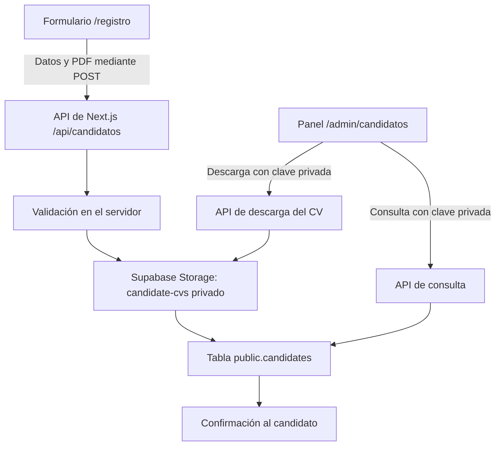

# Implementación del registro de candidatos y CV

La web tiene preparado un registro que envía los datos del candidato y su currículum al servidor de Next.js. El servidor valida la solicitud, guarda el PDF en Supabase Storage y registra los datos en una tabla de Supabase. Un panel privado permite consultar candidaturas, aplicar filtros profesionales y descargar los archivos.

**Estado actual:** el código está implementado y compila, pero todavía falta configurar el proyecto real de Supabase. Las pruebas realizadas usan una simulación de Supabase; no demuestran una conexión real ni han guardado candidaturas en una cuenta del usuario.

## Arquitectura



El navegador no recibe la clave de servicio de Supabase. Las operaciones con la base de datos y Storage pasan por las rutas del servidor.

## Archivos y responsabilidades

| Archivo | Función |
| --- | --- |
| [app/registro/page.tsx](app/registro/page.tsx) | Página de candidatos, con la identidad visual y el formulario integrado en el fondo. |
| [components/CandidateForm.tsx](components/CandidateForm.tsx) | Campos, adjunto PDF, envío, estado de carga y mensajes de resultado. |
| [lib/candidates.ts](lib/candidates.ts) | Cliente de Supabase, comprobación de la clave administrativa y cabeceras de privacidad. |
| [app/api/candidatos/route.ts](app/api/candidatos/route.ts) | Recepción y validación de candidaturas; consulta con filtros. |
| [app/api/candidatos/[id]/cv/route.ts](app/api/candidatos/[id]/cv/route.ts) | Descarga protegida del PDF de una candidatura. |
| [app/admin/candidatos/page.tsx](app/admin/candidatos/page.tsx) | Panel de consulta, filtros y descarga de CV. |
| [supabase/candidates.sql](supabase/candidates.sql) | Creación de la tabla, índices, permisos y contenedor privado de archivos. |
| [supabase/SETUP.md](supabase/SETUP.md) | Instrucciones para activar la conexión real. |
| [tests/candidates.test.cjs](tests/candidates.test.cjs) | Ocho pruebas de las rutas con Supabase simulado. |

Se añadió la dependencia `@supabase/supabase-js`. El formulario comercial de `/solicitar-servicio` se integró posteriormente con su propia tabla de Supabase y panel privado. Consulta [IMPLEMENTACION_CLIENTES.md](IMPLEMENTACION_CLIENTES.md) para esa implementación; los candidatos conservan su tabla y almacenamiento de CV independientes.

## Datos del candidato

El formulario solicita nombre, email, teléfono, ciudad, años de experiencia, sector, empresas anteriores, puesto de interés y disponibilidad, además del CV y el consentimiento para guardar la candidatura.

La tabla `public.candidates` contiene:

| Columna | Tipo | Contenido |
| --- | --- | --- |
| `id` | UUID | Identificador generado en el servidor. |
| `name` | Texto | Nombre y apellidos. |
| `email` | Texto | Correo de contacto. |
| `phone` | Texto | Teléfono. |
| `city` | Texto | Ciudad. |
| `years` | Numérico | Experiencia entre 0 y 80 años. |
| `sector` | Texto | Sector indicado por el candidato. |
| `companies` | Texto | Empresas anteriores, que pueden escribirse una por línea. |
| `availability` | Texto | Puesto de interés, experiencia y disponibilidad en un campo libre. |
| `consent_at` | Fecha y hora con zona horaria | Momento del consentimiento recibido con la solicitud. |
| `cv_path` | Texto único | Ruta del PDF dentro del contenedor privado. |

El PDF no se almacena dentro de la tabla. Se guarda en el bucket `candidate-cvs`, con una ruta como `UUID/cv.pdf`. El nombre original del archivo no se utiliza en esa ruta.

No se añadieron campos ni filtros de selección por sexo o nacionalidad. Los filtros implementados se basan en experiencia, sector y empresas anteriores. Tampoco se extraen datos automáticamente del CV: se consulta la información introducida en el formulario.

## Cómo se guarda una candidatura

1. El candidato completa `/registro`, adjunta su PDF y marca el consentimiento.
2. `CandidateForm` crea un `FormData` y lo envía mediante `fetch` a `POST /api/candidatos`.
3. Mientras se procesa el envío, el formulario se deshabilita para evitar envíos repetidos desde ese mismo formulario.
4. La API comprueba los datos y el archivo antes de llamar a Supabase.
5. El servidor genera un UUID y sube el PDF al contenedor privado.
6. Si la subida termina correctamente, inserta los datos y la ruta del PDF en `candidates`.
7. Solo cuando ambas operaciones terminan devuelve HTTP `201` con `{ "ok": true }`.
8. El formulario muestra la confirmación y limpia los campos. Ante un error, conserva los datos para permitir otro intento.

Storage y la tabla son dos operaciones separadas, no una transacción única. Si falla la inserción de datos después de subir el PDF, el código intenta borrar ese PDF. Si también falla esa limpieza o se interrumpe el proceso entre operaciones, puede quedar un archivo sin registro asociado.

## Validaciones

El servidor aplica estas comprobaciones aunque el usuario omita la validación del navegador:

- Campos obligatorios no vacíos; máximo de 200 caracteres para los textos cortos y de 3.000 para empresas y disponibilidad.
- Formato básico del email.
- Experiencia numérica entre 0 y 80 años. El formulario permite incrementos de medio año.
- Consentimiento marcado.
- CV no vacío, extensión `.pdf` y tamaño máximo de 5 MB, implementado como `5 × 1024 × 1024` bytes.
- Cabecera del archivo comenzando por `%PDF-`.
- Cuerpo total de la petición limitado a 6 MB para incluir el PDF y los campos del formulario.
- Rechazo de peticiones cuyo encabezado `Origin`, cuando está presente, no coincide con el origen de la API.

La comprobación de la cabecera PDF es básica: no analiza todo el documento ni sustituye un antivirus. El control de origen tampoco sustituye un sistema contra envíos automatizados.

## Panel y filtros

El panel se abre en `/admin/candidatos`. Su estructura es accesible, pero los datos solo se consultan con una clave administrativa válida.

| Filtro | Comportamiento |
| --- | --- |
| Experiencia mínima | Incluye candidatos con ese número de años o más. |
| Experiencia máxima | Incluye candidatos con ese número de años o menos. |
| Sector | Busca una coincidencia parcial sin distinguir mayúsculas y minúsculas. |
| Empresa anterior | Busca una coincidencia parcial en el texto de empresas anteriores. |

Los filtros se combinan: una candidatura debe cumplir todos los criterios introducidos. Sin un rango explícito, se utiliza de 0 a 80 años. Los resultados se ordenan por fecha de recepción, del más reciente al más antiguo, con un máximo de 200 filas. No hay paginación todavía.

La tabla muestra los datos de contacto, experiencia, sector, empresas y disponibilidad. El botón de descarga solicita el archivo a una ruta protegida; no publica un enlace permanente al CV.

## Protección del acceso

La implementación usa una clave administrativa compartida, `CANDIDATE_ADMIN_TOKEN`, independiente de las credenciales de Supabase. No utiliza todavía Supabase Auth ni cuentas individuales de empleados.

El panel conserva esa clave solo en el estado de React y la envía en el encabezado `Authorization: Bearer ...`. No la guarda en `localStorage`, cookies ni parámetros de la URL. El botón «Cerrar acceso» elimina la clave y los resultados del estado del panel.

El servidor rechaza el acceso si la clave no está configurada, tiene menos de 32 caracteres o no coincide. La comparación usa `timingSafeEqual` después de comprobar la longitud. Las consultas y las descargas sin autorización devuelven HTTP `401`.

En Supabase, el script habilita Row Level Security para la tabla y revoca sus permisos a `anon` y `authenticated`. El servidor accede con la clave de servicio. El bucket se configura como privado y admite únicamente PDF de hasta 5 MB. El script no crea políticas de lectura pública.

Las respuestas privadas utilizan `Cache-Control: no-store`. Las descargas incluyen `Content-Disposition: attachment`, `X-Content-Type-Options: nosniff` y una política `sandbox`.

## Configuración pendiente

1. Crear el proyecto de Supabase.
2. Ejecutar [supabase/candidates.sql](supabase/candidates.sql) en el SQL Editor del proyecto.
3. Configurar estas variables en `.env.local` para desarrollo y en las variables privadas del alojamiento para producción:

```dotenv
SUPABASE_URL=https://TU-PROYECTO.supabase.co
SUPABASE_SERVICE_ROLE_KEY=TU_CLAVE_PRIVADA_DE_SUPABASE
CANDIDATE_ADMIN_TOKEN=UNA_CLAVE_ALEATORIA_INDEPENDIENTE_DE_AL_MENOS_32_CARACTERES
```

4. Reiniciar el servidor y enviar una candidatura de prueba.
5. Verificar en Supabase que existen tanto la fila como el PDF privado.
6. Abrir `/admin/candidatos` con la clave administrativa, probar los filtros y descargar el CV.
7. Comprobar que las consultas y descargas sin clave fallan.

Las claves son privadas: no deben llevar el prefijo `NEXT_PUBLIC_`, incluirse en el repositorio ni introducirse en el formulario de candidatos. En el panel se introduce únicamente `CANDIDATE_ADMIN_TOKEN`, nunca la clave de servicio de Supabase.

## Verificación realizada

Se ejecutaron correctamente estos comandos:

```powershell
node --test tests/candidates.test.cjs
npx.cmd tsc --noEmit
npm.cmd run build
```

Las ocho pruebas verifican:

1. Guardado de los datos y PDF mediante el cliente simulado, sin devolver una URL del archivo.
2. Rechazo de consentimiento ausente, experiencia inválida, email incorrecto y archivos que no tienen cabecera PDF.
3. Rechazo de cuerpos demasiado grandes y de un origen diferente.
4. Intento de limpieza del PDF cuando falla la inserción de la candidatura.
5. Ausencia de inserción cuando falla la subida del archivo.
6. Protección de las consultas y descargas, incluso cuando falta la configuración administrativa.
7. Combinación de filtros profesionales y rechazo de rangos invertidos.
8. Cabeceras de descarga y privacidad del CV.

Las pruebas ejecutan los manejadores reales de las rutas, sustituyendo el cliente de Supabase por un doble en memoria. No verifican la ejecución del SQL, las políticas de un proyecto remoto, la red ni el recorrido completo en un navegador. Esa comprobación queda pendiente de configurar el proyecto real.

## Límites actuales y siguientes pasos

- No hay usuarios administrativos individuales, roles ni registro de auditoría del acceso al panel.
- No hay límites de frecuencia integrados ni CAPTCHA; deben definirse antes de abrir el registro público.
- No hay detección de candidaturas duplicadas, análisis automático del CV ni escaneo antivirus.
- No hay edición, eliminación ni exportación de candidaturas en el panel.
- No hay paginación más allá del máximo de 200 resultados.
- El plazo de conservación, la eliminación de datos y CV y el aviso de privacidad definitivo están pendientes de definición.
- El alojamiento debe permitir el tamaño de petición previsto y utilizar HTTPS. Sus límites pueden ser menores que los configurados en la API.
- El guardado en Supabase necesita una prueba real tras añadir las credenciales y ejecutar el script.

## Referencias utilizadas

- [Subidas de archivos con Supabase Storage](https://supabase.com/docs/guides/storage/uploads/standard-uploads).
- [Permisos y protección de la API de Supabase](https://supabase.com/docs/guides/api/securing-your-api).
- [Descargas de archivos de Supabase Storage](https://supabase.com/docs/guides/storage/serving/downloads).

También se consultó la documentación de Route Handlers incluida en la versión de Next.js instalada en el proyecto.
