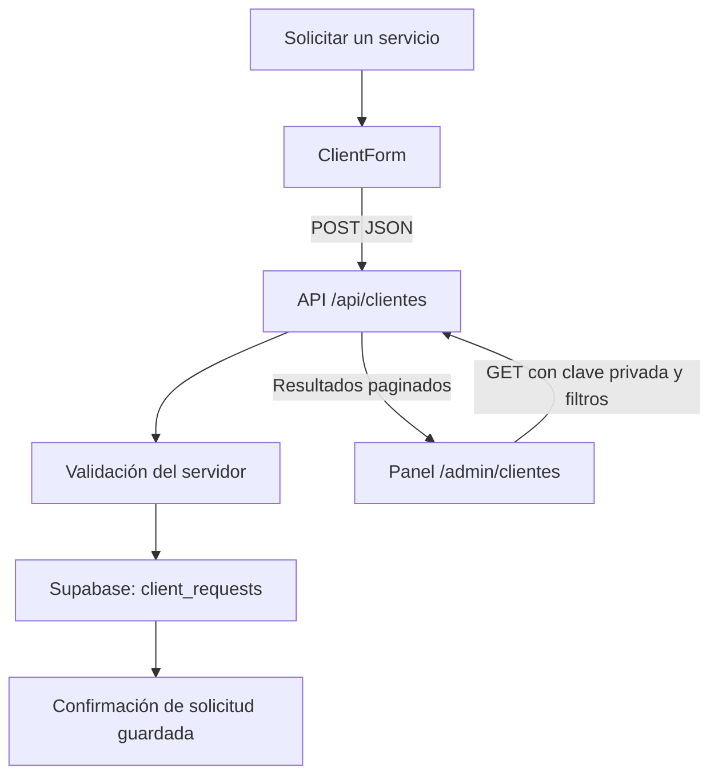

# Implementación de clientes y solicitudes comerciales

El formulario de `/solicitar-servicio` está preparado para guardar los datos de contacto de las empresas y sus necesidades en Supabase. El panel privado `/admin/clientes` permite consultar esas solicitudes y combinarlas mediante filtros comerciales.

**Estado:** la implementación está terminada en el código. Para que guarde datos reales falta ejecutar el SQL y configurar las credenciales del proyecto Supabase. Las pruebas utilizan Supabase simulado.

## Qué se guarda y por qué

Cada registro representa **una solicitud de servicio**, no una empresa única. Una misma empresa puede solicitar varios eventos en fechas o ciudades diferentes. No se sobrescribe su solicitud anterior ni se fusionan automáticamente empresas por nombre o email.

| Dato | Obligatorio | Utilidad |
| --- | --- | --- |
| Empresa | Sí | Identificar y buscar al cliente. |
| Nombre y apellidos | Sí | Persona de contacto. |
| Email | Sí | Responder a la solicitud. |
| Teléfono | No | Contacto comercial adicional. |
| Sector | Sí | Agrupar solicitudes de hoteles, restaurantes, catering, eventos y otros sectores. |
| Servicio | Sí | Identificar el perfil solicitado: camareros, maîtres, housekeeping, hostess, cocina o supervisión. |
| Ciudad del servicio | Sí | Organizar la cobertura geográfica. |
| Fecha del evento | No | Planificar la disponibilidad del equipo. |
| Número de profesionales | No | Dimensionar el servicio. |
| Presupuesto estimado en euros | No | Preparar una propuesta acorde al alcance previsto. |
| Descripción de la necesidad | Sí | Conservar los detalles de la solicitud. |
| Fecha y hora del consentimiento | Sí, generada en el servidor | Registrar cuándo se autorizó guardar los datos para atender la solicitud. |

La fecha, el personal y el presupuesto pueden quedar pendientes de definir. Se guardan como `NULL` cuando no se indican; un presupuesto de cero se conserva como cero y no se confunde con un dato ausente.

## Flujo de envío



1. El usuario llega desde un botón de empresa, un servicio o una tarjeta del carrusel.
2. Se mantiene la preselección de sector o servicio recibida en la URL.
3. El formulario recoge los datos y los envía en JSON a `POST /api/clientes`.
4. El servidor valida la solicitud y genera su UUID y la fecha del consentimiento.
5. El cliente de Supabase inserta una fila en `public.client_requests`.
6. Solo después de una inserción correcta se devuelve HTTP `201` y se muestra la confirmación.

El formulario se deshabilita durante el envío. Si falla la conexión o el guardado, muestra un error y conserva los campos para reintentar.

El formulario comercial **ya no abre la aplicación de correo**. Esta implementación guarda la solicitud, pero no envía un email automático al equipo ni al cliente. El componente `EmailForm` anterior queda sin utilizar por esta página.

## Archivos

| Archivo | Responsabilidad |
| --- | --- |
| [app/solicitar-servicio/page.tsx](app/solicitar-servicio/page.tsx) | Mantiene el diseño de marca y entrega la preselección al formulario. |
| [components/ClientForm.tsx](components/ClientForm.tsx) | Campos, consentimiento, envío y mensajes de estado. |
| [lib/service-options.ts](lib/service-options.ts) | Catálogos compartidos de sectores y servicios y comprobación de fechas. |
| [app/api/clientes/route.ts](app/api/clientes/route.ts) | Validación, inserción y consultas filtradas. |
| [lib/candidates.ts](lib/candidates.ts) | Cliente de Supabase y autenticación administrativa reutilizados de la integración de candidatos. |
| [app/admin/clientes/page.tsx](app/admin/clientes/page.tsx) | Panel privado, filtros, tabla y paginación. |
| [supabase/clients.sql](supabase/clients.sql) | Tabla, restricciones, índices y permisos. |
| [tests/clients.test.cjs](tests/clients.test.cjs) | Pruebas de guardado, validación, acceso, filtros y fallos. |

Los paneles de clientes y candidatos incluyen enlaces entre ellos. No se ha cambiado el formulario de candidatos ni su almacenamiento de CV.

## Base de datos

La tabla `public.client_requests` tiene estas columnas:

```text
id            uuid, clave primaria
name          text
company       text
email         text
phone         text, opcional
city          text
sector        text, identificador del catálogo
service       text, identificador del catálogo
event_date    date, opcional
staff_count   integer, opcional
budget        numeric(11,2), opcional, euros
message       text
consent_at    timestamptz
```

Se añadieron índices para fecha del evento, sector y servicio, fecha de recepción, presupuesto y cantidad de personal. Los importes utilizan un tipo decimal en la base de datos.

No hay archivos adjuntos en las solicitudes comerciales. La tabla es independiente de `candidates` y no necesita otro bucket de Storage.

## Filtros disponibles

| Filtro | Comportamiento |
| --- | --- |
| Empresa | Coincidencia parcial, sin distinguir mayúsculas y minúsculas. |
| Ciudad | Coincidencia parcial, sin distinguir mayúsculas y minúsculas. |
| Sector | Coincidencia exacta con una opción del catálogo. |
| Servicio | Coincidencia exacta con una opción del catálogo. |
| Evento desde / hasta | Intervalo inclusivo sobre la fecha del evento. |
| Personal mínimo / máximo | Intervalo inclusivo sobre el número de profesionales. |
| Presupuesto mínimo / máximo | Intervalo inclusivo en euros. |

Todos los filtros se combinan. Por ejemplo, se pueden consultar solicitudes de hoteles en Madrid para camareros, en un mes concreto, que necesiten entre 5 y 15 profesionales.

Las solicitudes sin fecha, personal o presupuesto se muestran cuando no se filtra por ese campo. Al aplicar un rango, las filas con ese campo pendiente quedan fuera de la comparación.

Los resultados se ordenan del más reciente al más antiguo según `consent_at`, con `id` como segundo criterio. El panel muestra 50 solicitudes por página, incluye el total y permite navegar sin perder los filtros. «Limpiar filtros» restablece la búsqueda.

No se ha añadido puntuación automática de clientes ni decisiones comerciales automáticas.

## Validaciones y acceso

El servidor comprueba:

- JSON válido y cuerpo de petición de hasta 32 KiB.
- Campos obligatorios y longitudes: hasta 200 caracteres en textos cortos, 100 en teléfono y 5.000 en descripción.
- Formato básico del email y consentimiento marcado.
- Sector y servicio pertenecientes a los catálogos.
- Fechas de calendario válidas: una fecha como `2027-02-30` se rechaza.
- Personal entero entre 1 y 10.000, si se indica.
- Presupuesto entre 0 y 100.000.000 euros, con hasta dos decimales.
- Rangos de búsqueda coherentes y paginación válida.
- Origen coincidente cuando la solicitud incluye el encabezado `Origin`.

La consulta requiere la misma `CANDIDATE_ADMIN_TOKEN` usada por el panel de candidatos, pese al nombre de la variable. Debe ser una clave privada independiente de al menos 32 caracteres. No se añade una segunda contraseña para clientes.

El panel envía la clave por `Authorization: Bearer ...` y la mantiene solo en memoria. No se incluye en la URL ni en almacenamiento persistente del navegador. Al cerrar el acceso o cambiar la clave, cancela la consulta pendiente y limpia los resultados. Las respuestas privadas incluyen `Cache-Control: no-store`.

En Supabase, el script habilita Row Level Security y revoca el acceso de `anon` y `authenticated` a la tabla. El servidor utiliza la clave de servicio privada. Sin autorización, la API de consulta devuelve `401` antes de consultar Supabase. El envío de una nueva solicitud sí es público.

## Activación en Supabase

1. Ejecuta [supabase/clients.sql](supabase/clients.sql) en el SQL Editor de tu proyecto.
2. Configura las mismas variables utilizadas para candidatos:

```dotenv
SUPABASE_URL=https://TU-PROYECTO.supabase.co
SUPABASE_SERVICE_ROLE_KEY=TU_CLAVE_PRIVADA_DE_SUPABASE
CANDIDATE_ADMIN_TOKEN=UNA_CLAVE_ADMINISTRATIVA_ALEATORIA_DE_AL_MENOS_32_CARACTERES
```

3. Reinicia la aplicación.
4. Envía una solicitud de prueba desde `/solicitar-servicio`.
5. Comprueba la fila en `client_requests` y búscala desde `/admin/clientes` con la clave administrativa.
6. Comprueba filtros combinados, datos opcionales pendientes y consulta sin clave.

Si ya configuraste candidatos, reutiliza las variables existentes y ejecuta únicamente el SQL adicional de clientes. No publiques las claves ni uses el prefijo `NEXT_PUBLIC_`.

## Pruebas

```powershell
node --test tests/candidates.test.cjs tests/clients.test.cjs
npx.cmd tsc --noEmit
npm.cmd run build
```

Las ocho pruebas nuevas cubren guardado con valores opcionales, presupuesto cero, solicitudes independientes de una misma empresa, datos inválidos, peticiones malformadas o demasiado grandes, acceso privado, filtros combinados, paginación y errores de base de datos. Se ejecutaron también las ocho pruebas existentes de candidatos.

El cliente de Supabase se sustituye por un doble en memoria. Estas pruebas no verifican el SQL ni la conexión a una cuenta real; esa validación queda pendiente de crear y configurar el proyecto.

## Alcance pendiente

Esta es una bandeja de solicitudes comerciales, no un CRM completo. Todavía no incluye ficha única de empresa, estados comerciales, asignación a comerciales, edición, eliminación, exportación ni notificaciones automáticas.

Antes del uso público deben configurarse los límites de frecuencia en el alojamiento, HTTPS, el aviso de privacidad y la conservación de datos. El acceso actual mediante clave compartida no tiene cuentas individuales ni auditoría; puede evolucionar a Supabase Auth cuando se defina el equipo autorizado.
