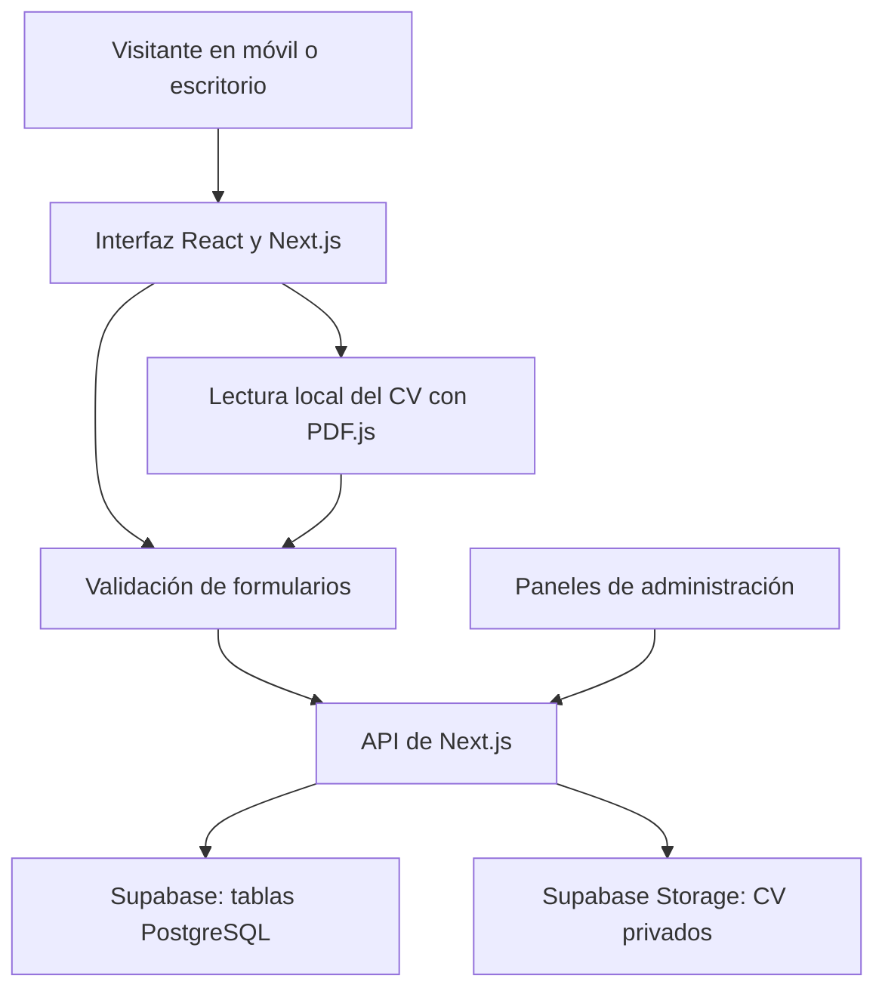

# Tecnologías y librerías de Premium Work

Documento basado en el código y en `package.json`, revisados el 16 de septiembre de 2026. Las versiones indicadas son los rangos declarados en ese archivo; `package-lock.json` fija las versiones que instala npm.

## Cómo funciona el proyecto

Premium Work combina una web corporativa, formularios de candidatos y clientes, y paneles de administración. Next.js reúne las páginas y las API en una misma aplicación. Supabase almacena los datos y los currículums.

El alojamiento ejecuta la web y sus API. El dominio es la dirección para acceder a ella. Supabase es un servicio separado: cambiar de alojamiento no exige cambiar de base de datos.

## Tecnologías principales

| Tecnología | Para qué se utiliza aquí | Dónde verla |
| --- | --- | --- |
| **Next.js** | Organiza las páginas con App Router, genera la web, gestiona metadatos y cabeceras HTTP, y ejecuta las API que reciben y consultan formularios. | `app/`, `next.config.ts` |
| **React** | Construye componentes reutilizables y controla la interacción: menús, carruseles, selección de países, estados de carga y mensajes de los formularios. | `components/`, páginas de administración |
| **TypeScript** | Añade tipos y comprobaciones durante el desarrollo para detectar errores en componentes, datos y funciones. No sustituye la validación de los datos recibidos. | Archivos `.ts` y `.tsx`, `tsconfig.json` |
| **Node.js 24.x** | Ejecuta las herramientas de desarrollo, compilación, scripts y el servidor convencional de Next.js. | `engines` en `package.json`, `scripts/` |
| **Tailwind CSS y CSS propio** | Definen colores, espacios, tipografías, tamaños adaptados a móvil/escritorio y animaciones visuales. | Clases de componentes y `app/globals.css` |
| **Supabase** | Proporciona acceso a la base de datos PostgreSQL y almacenamiento de archivos. La aplicación lo utiliza desde sus API. | `lib/candidates.ts`, `app/api/` |
| **PostgreSQL y SQL** | Guardan los campos de candidatos y solicitudes mediante tablas, tipos y restricciones. Los scripts SQL preparan el esquema y activan RLS. | `supabase/*.sql` |
| **npm** | Instala dependencias y ejecuta comandos del proyecto. | `package.json`, `package-lock.json` |
| **Git** | Registra cambios y permite organizar versiones del código mediante commits. | Repositorio del proyecto |

## Librerías de la aplicación

Estas son todas las dependencias directas declaradas en `dependencies` al revisar el proyecto.

| Librería | Versión declarada | Uso concreto |
| --- | --- | --- |
| `next` | `^16.2.12` | Framework de la aplicación. También se utiliza `next/navigation` para detectar la ruta y `next/image` para el logotipo de la navegación. |
| `react` | `19.2.4` | Componentes y hooks como `useState`, `useEffect`, `useRef` y `useId`. |
| `react-dom` | `19.2.4` | Integra React con el DOM del navegador; Next.js lo utiliza para renderizar e hidratar la interfaz. |
| `@supabase/supabase-js` | `^2.116.0` | Crea el cliente de Supabase para insertar y consultar registros, subir CV y gestionar su acceso. También se utiliza en scripts de comprobación. |
| `framer-motion` | `^12.42.2` | Animaciones de entrada, transiciones del hero y efectos de secciones. `useReducedMotion` se usa en algunas secciones para adaptar efectos a la preferencia de movimiento reducido. |
| `lucide-react` | `^1.26.0` | Iconos SVG: flechas, menú móvil, cerrar, correo y otros elementos de la interfaz. |
| `country-flag-icons` | `1.6.20` | Banderas SVG que acompañan a los países en el selector de teléfono. |
| `libphonenumber-js` | `1.13.13` | Lista de países y prefijos, interpretación de teléfonos y comprobación de números posibles. Normaliza los números antes de guardarlos; no verifica que pertenezcan al usuario. |
| `pdfjs-dist` | `6.3.289` | PDF.js lee el texto del CV en el dispositivo del visitante. Un Web Worker realiza el procesamiento del PDF y el código propio interpreta los campos. |

### Librería usada por un script

`sharp` se utiliza en `scripts/optimize-carousel.cjs` para recortar, redimensionar y comprimir las fotos del carrusel a WebP. Genera versiones para móvil y escritorio y el manifiesto `lib/carousel-images.json`, conservando los originales.

Actualmente está disponible como dependencia transitiva de Next.js, pero no está declarada directamente en `package.json`. No se ejecuta en el móvil del visitante: las imágenes optimizadas se generan antes de publicar. Si el script se mantiene como herramienta independiente, conviene declarar `sharp` como dependencia directa de desarrollo.

## Librerías de desarrollo y pruebas

Estas son todas las dependencias declaradas en `devDependencies` durante la revisión.

| Librería | Versión declarada | Para qué sirve |
| --- | --- | --- |
| `typescript` | `^5` | Comprueba tipos. Algunas pruebas y scripts también lo usan para transformar módulos TypeScript y ejecutarlos con dependencias simuladas. |
| `tailwindcss` | `^4` | Genera las utilidades CSS utilizadas en el diseño. |
| `@tailwindcss/postcss` | `^4` | Integra Tailwind con el procesamiento CSS de la compilación mediante `postcss.config.mjs`. |
| `eslint` | `^10.8.1` | Analiza el código para detectar problemas y patrones no recomendados. |
| `eslint-config-next` | `^16.2.12` | Aporta las reglas de ESLint para Next.js, React y TypeScript configuradas en `eslint.config.mjs`. |
| `@playwright/test` | `^1.63.0` | Ejecuta pruebas en navegador de formularios, móvil, cookies y lectura de CV. En Windows, la configuración actual utiliza Microsoft Edge. |
| `@types/node` | `^20` | Definiciones TypeScript de las API de Node.js. Esta versión de tipos es distinta del runtime Node.js 24 declarado por el proyecto. |
| `@types/react` | `^19` | Tipos de componentes, hooks y eventos de React. |
| `@types/react-dom` | `^19` | Tipos de las API que integran React con el navegador. |

Las dependencias transitivas instaladas por estas herramientas están recogidas en `package-lock.json`; no todas se utilizan directamente desde el código del proyecto.

## Funcionalidades implementadas con código propio

| Funcionalidad | Cómo está implementada |
| --- | --- |
| Validación de formularios | `lib/form-validation.ts` comparte reglas entre navegador y servidor. `components/useFormValidation.tsx` muestra errores y dirige el foco al campo que debe corregirse. |
| Selección de ciudades | Ambos formularios usan `CityField.tsx` y `lib/contact-options.ts`. La selección actual procede de `lib/spanish-main-cities.json`; la lista completa anterior permanece en `lib/spanish-cities.json`. No se consulta una API de ciudades. |
| Autorrelleno del CV | `lib/read-cv.ts` extrae texto con PDF.js y `lib/cv-fields.ts` identifica datos mediante reglas. No utiliza un servicio de IA ni OCR para documentos escaneados. |
| Envío de formularios | `lib/submit-form.ts` utiliza `fetch` al mismo dominio, controla el tiempo de espera y traduce errores de conexión. No reintenta automáticamente un POST para evitar duplicados si se pierde la respuesta. |
| Preferencias de cookies | `CookiePreferences.tsx` y `lib/cookie-preferences.ts` gestionan las preferencias con almacenamiento local del navegador. |
| Carrusel de servicios | `ClientsCarousel.tsx` utiliza estado y temporizadores de React, transiciones CSS y gestos táctiles. No depende de una librería específica de carruseles. |
| Imágenes adaptadas | El carrusel utiliza `picture`, `srcSet`, `sizes` y carga diferida para seleccionar archivos adecuados a cada pantalla. |
| Páginas legales | Componentes y datos locales en `lib/legal.ts`. La presencia de estas páginas no acredita una revisión legal; el archivo identifica datos ficticios de prueba. |

El autorrelleno admite PDF de hasta 4 MB y limita la lectura automática a 20 páginas. El CV se lee localmente para sugerir campos y se sube al presentar la candidatura.

## Datos, archivos y administración

| Recurso | Uso |
| --- | --- |
| Tabla `candidates` | Nombre, contacto, ciudad, experiencia, sector, empresas, disponibilidad, consentimiento y referencia al CV. |
| Tabla `client_requests` | Contacto de la empresa, servicio, sector, ciudad, fecha, personal solicitado, presupuesto y mensaje. |
| Bucket privado `candidate-cvs` | Archivos PDF de las candidaturas. |
| `/api/candidatos` | Recepción de candidaturas y consulta administrativa. |
| `/api/clientes` | Recepción de solicitudes de servicio y consulta administrativa con filtros. |
| `/api/candidatos/[id]/cv` | Acceso autorizado al CV de una candidatura. |
| `/admin/candidatos` y `/admin/clientes` | Pantallas de consulta protegidas mediante el token administrativo en las peticiones a las API. |

La administración actual utiliza `CANDIDATE_ADMIN_TOKEN`; no implementa un inicio de sesión de usuarios con Supabase Auth. Las API comprueban ese token antes de consultar datos privados. El código usa `node:crypto` para generar identificadores y comparar el token administrativo.

### Variables de entorno

| Variable | Uso en el código revisado |
| --- | --- |
| `SUPABASE_URL` | Dirección del proyecto de Supabase. |
| `SUPABASE_SECRET_KEY` | Credencial de servidor que permite operar con la base de datos y Storage. |
| `SUPABASE_SERVICE_ROLE_KEY` | Alternativa admitida si no se define `SUPABASE_SECRET_KEY`. |
| `CANDIDATE_ADMIN_TOKEN` | Credencial de acceso a las API administrativas de candidatos y clientes. |
| `SUPABASE_PUBLISHABLE_KEY` y `SUPABASE_JWKS_URL` | Se han mencionado en la configuración del alojamiento, pero el código de la aplicación revisado no las utiliza. |

Las credenciales de servidor se configuran en el entorno del alojamiento. Este documento no contiene sus valores y no deben incorporarse al código del navegador.

## Alojamiento actual y cambio a Cloudflare

**Vercel** es el alojamiento utilizado hasta ahora, según la configuración y el contexto del proyecto. Publica la aplicación Next.js y ejecuta sus API; las instrucciones existentes están en `VERCEL_SETUP.md`.

**Cloudflare** es el destino solicitado para la migración. Al redactar este documento, no hay una configuración de Wrangler ni de OpenNext incorporada al proyecto y no se ha verificado un despliegue allí. La instalación iniciada durante la preparación aún no consta en `package.json` revisado.

Las herramientas previstas para esa adaptación son:

| Tecnología prevista | Función |
| --- | --- |
| Cloudflare Workers | Ejecutar la aplicación y sus API en Cloudflare. Los formularios necesitan ejecución de servidor, además de los archivos estáticos. |
| `@opennextjs/cloudflare` | Adaptar la compilación de Next.js al entorno de Workers. |
| `wrangler` | Configurar, probar y desplegar el Worker y gestionar su entorno. |

Estas herramientas se describen como **previstas**, no como una migración terminada. Supabase seguiría almacenando formularios y CV. El dominio y sus registros DNS se conectarían al nuevo alojamiento cuando el despliegue estuviera comprobado.

## Herramientas nativas que también se utilizan

- **API del navegador:** `fetch`, `FormData`, `File`, `AbortController`, `localStorage` y Web Workers para comunicaciones, archivos, preferencias y lectura del PDF.
- **Módulos de Node.js:** `node:crypto`, `node:fs`, `node:fs/promises` y `node:path` para identificadores, comprobaciones y scripts de archivos.
- **Pruebas nativas de Node.js:** `node:test` y `node:assert/strict` para verificar reglas y API con dependencias simuladas.
- **JSON:** listas de ciudades y manifiesto de imágenes locales.
- **WebP y SVG:** fotografías comprimidas e iconos/banderas vectoriales.

## Comandos habituales

Ejecutar desde la carpeta que contiene `package.json`. En PowerShell se puede usar `npm.cmd` y `npx.cmd` si la política del sistema bloquea los archivos `.ps1`.

| Comando | Acción |
| --- | --- |
| `npm run dev` | Inicia el entorno de desarrollo. |
| `npm run build` | Genera la compilación de producción con Next.js. |
| `npm run start` | Sirve una compilación existente con el servidor de Next.js. |
| `npm run lint` | Ejecuta el análisis de ESLint. |
| `npx tsc --noEmit` | Comprueba tipos sin generar archivos JavaScript. |
| `node --test tests/*.test.cjs` | Ejecuta las pruebas de lógica y API. |
| `npx playwright test` | Ejecuta las pruebas de navegador; la configuración actual inicia el servidor sobre una compilación existente. |
| `node scripts/optimize-carousel.cjs` | Regenera las imágenes optimizadas del carrusel. |

Documentar estos comandos no significa que todos se hayan ejecutado en esta revisión. Los cambios recientes en ciudades y manejo de errores de envío estaban pendientes de verificación al redactar el documento; la causa del error móvil «Failed to fetch» aún no está confirmada.
